# Apache Hadoop

> 本文是 Hadoop 学习与实验笔记，示例主要来自 Hadoop 2.x 环境。不同发行版和版本的默认配置、命令及端口可能不同；部署时请以实际配置和对应版本的官方文档为准。

## 目录

- [1. Hadoop 简介](#1-hadoop-简介)
- [2. 核心组件与基本操作](#2-核心组件与基本操作)
  - [2.1 HDFS：分布式存储](#21-hdfs分布式存储)
  - [2.2 MapReduce：分布式计算](#22-mapreduce分布式计算)
  - [2.3 YARN：资源调度](#23-yarn资源调度)
- [3. 进阶原理](#3-进阶原理)
  - [3.1 fsimage 与 edits](#31-fsimage-与-edits)
  - [3.2 HDFS 高可用](#32-hdfs-高可用)
- [附录](#附录)

## 1. Hadoop 简介

### 什么是 Hadoop？

- **狭义**：Apache Hadoop 是 Apache 软件基金会维护的开源分布式数据处理平台。它提供大规模数据存储、批处理计算和集群资源管理能力。
  - **HDFS**：分布式文件系统，负责存储数据。
  - **MapReduce**：分布式批处理计算框架。
  - **YARN**：集群资源管理与任务调度平台。
  - **Hadoop Common**：其他模块共享的基础库和工具。

- **广义**：日常交流中的“Hadoop 生态”通常还包括 Hive、HBase、Spark、Flink、ZooKeeper、Kafka 等项目。这些项目与 Hadoop 集成或协同工作，但并不都属于 Apache Hadoop 本身。

## 2. 核心组件与基本操作

### 2.1 HDFS：分布式存储

HDFS（Hadoop Distributed File System）将大文件拆分为数据块，分散存储在多个 DataNode 上，并通过副本机制提高容错能力。

启动 HDFS 服务：

```bash
start-dfs.sh
```

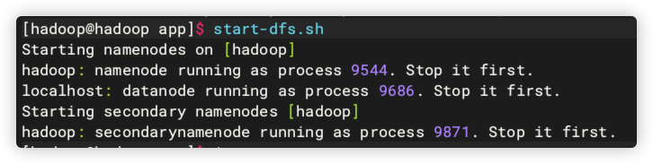

- **NameNode**：管理文件系统命名空间及元数据，例如目录、文件权限、文件到数据块的映射和副本数；它通常不保存文件内容本身。
- **DataNode**：在本地磁盘保存数据块，并按 NameNode 指令创建、删除或复制数据块，同时向 NameNode 汇报状态。

访问 HDFS 时使用 `hadoop fs`（或 `hdfs dfs`）命令；不带这些前缀的 `ls`、`mkdir` 等命令操作的是本地 Linux 文件系统。

当执行 `hadoop fs -ls /` 时，客户端会将 `/` 解析为 `fs.defaultFS` 指定的文件系统路径。该配置通常位于 `core-site.xml`；示例环境可能配置为 `hdfs://192.168.56.101:9000`，不要将示例地址当作通用默认值。

指定完整 URI 可以明确目标集群；省略 `hdfs://主机:端口` 时，客户端使用 `fs.defaultFS`。不同 Hadoop 版本和集群部署的 RPC 地址可能不同。

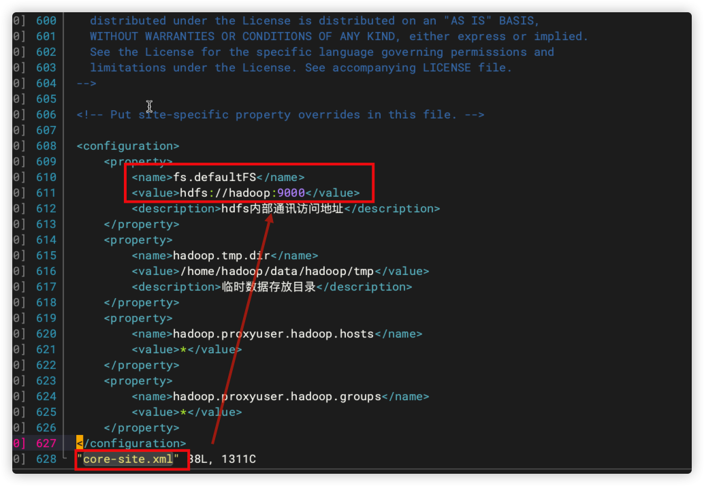

```bash
# 查看和创建 HDFS 目录
hadoop fs -ls /
hadoop fs -mkdir -p /input

# 上传、下载文件（本地路径与 HDFS 路径要区分）
hadoop fs -put ./test.txt /input/
hadoop fs -get /input/test.txt ./test.txt

# 查看文件、复制、移动和删除
hadoop fs -cat /input/test.txt
hadoop fs -mkdir -p /backup
hadoop fs -cp /input/test.txt /backup/
hadoop fs -mv /input/test.txt /input/renamed.txt
hadoop fs -rm /input/renamed.txt

# 查看命令帮助
hadoop fs -help
```

> `hadoop fs -rm -r` 会递归删除 HDFS 目录及其内容。执行删除命令前请确认目标路径；回收站行为由集群配置决定。

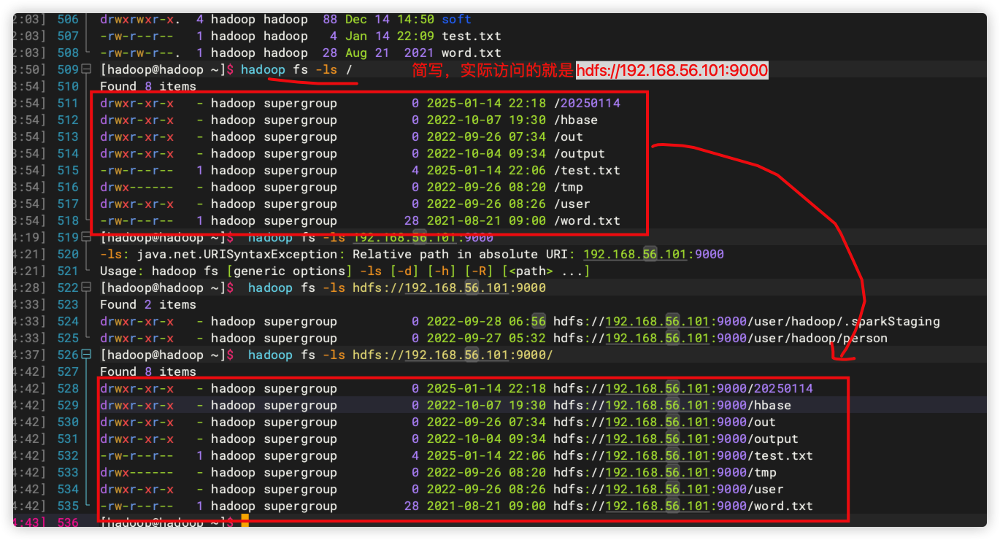

#### 数据块与副本

数据块（block）是 HDFS 存储文件的基本单位。文件可以小于一个块，也可以拆分为多个块；Hadoop 2.x 的常见默认块大小为 128 MiB，但可通过配置调整。块在 DataNode 本地磁盘上的实际文件大小可以小于块的配置上限，最后一个块通常不足一个完整块。

副本数由文件和集群配置决定，常见默认值为 3。副本存放在不同 DataNode 上有助于提高容错性，但副本数本身并不等于完整的备份策略；生产环境仍需规划故障域、快照和备份。

将文件切分为数据块的主要原因：

1. 文件可跨多台机器存储，不受单机磁盘容量限制。
2. 不同数据块可分布在多个节点上并行读取和处理。
3. 数据块可按策略复制，在节点或磁盘故障时提供容错能力。
4. 增加节点可扩展集群容量和吞吐能力。

#### 2.1.1 HDFS 写入流程

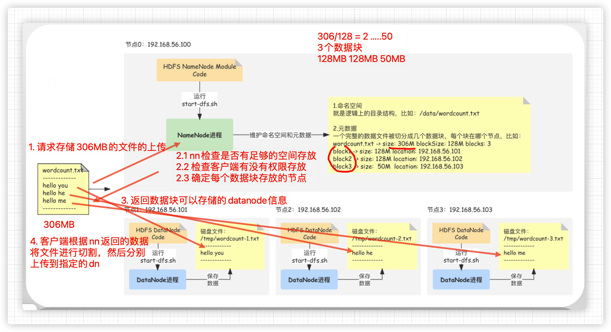

上传文件示例：`hadoop fs -put wordcount.txt /tmp`

NameNode 负责协调元数据操作和分配目标 DataNode；文件内容由客户端直接通过 DataNode 数据传输协议写入，NameNode 不转发文件数据。多副本写入时，客户端按 NameNode 返回的节点列表建立写入流水线。

#### 2.1.2 HDFS 读取流程

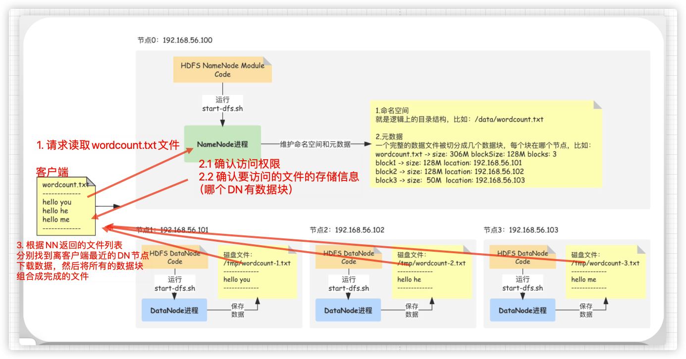

读取/下载文件示例：`hadoop fs -get /tmp/wordcount.txt ./`

客户端先向 NameNode 查询文件块位置，再从可用副本中选择合适的 DataNode 直接读取数据。NameNode 不转发文件内容；副本选择会考虑网络拓扑和可用性，不应简单理解为始终选择物理距离最近的节点。

读写流程可概括为：

1. 客户端向 NameNode 请求文件元数据或新建文件所需的块位置。
2. NameNode 返回块位置或可写 DataNode 列表；文件数据由客户端与 DataNode 直接传输。
3. DataNode 向 NameNode 汇报块状态，NameNode 根据副本策略监控并补齐副本。


### 2.2 MapReduce：分布式计算

MapReduce 是一种由 Google 提出的分布式批处理计算模型。Hadoop MapReduce 通过框架管理输入切分、任务调度、失败重试和结果输出；开发者主要实现数据处理逻辑。

MapReduce 的用户逻辑通常由 Map 和 Reduce 两类函数组成。Reduce 阶段可以省略，用于只需映射处理的任务。

MapReduce 的工作流程主要分为 Map、Shuffle 和 Reduce 三个阶段。

MapReduce 的核心思想是“分而治之”：并行处理数据分片，再汇总结果。

- **Map 阶段**：输入数据被切分为 input split，每个 Map 任务将记录转换为中间键值对。input split 是逻辑输入切分，不一定与 HDFS 数据块一一对应。
- **Shuffle 阶段**：框架按分区规则将中间数据发送到对应的 Reduce 任务，并在 Reduce 端按键分组、排序。相同键的数据会进入同一个 Reduce 分区。
- **Reduce 阶段**：对每个键及其对应的值集合进行汇总或转换，结果写入配置的输出位置。

可选的 **Combiner** 可以在 Map 端做局部聚合以减少网络传输，但只有在运算满足相应结合性、可交换性等要求时才适用；它不保证一定执行。

#### 2.2.1 基本开发流程

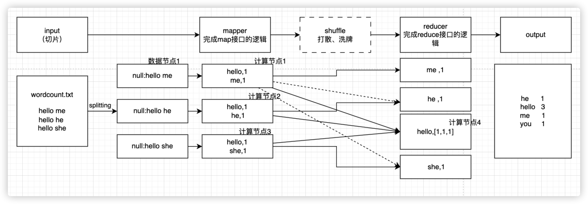

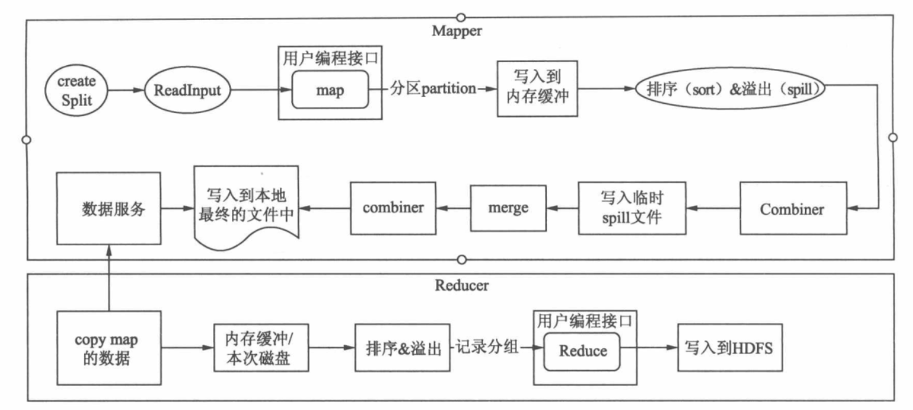


参考网盘“代码”目录下的项目。

1. 创建 Maven 项目并添加 `hadoop-client` 依赖。客户端依赖版本应与集群版本兼容，避免客户端和集群版本差异导致协议或配置问题。

   ```xml
       <dependency>
         <groupId>org.apache.hadoop</groupId>
         <artifactId>hadoop-client</artifactId>
         <version>2.7.7</version>
       </dependency>
   ```

2. 创建mapper类，实现map接口，完成map的业务逻辑

   1. 创建类，继承 `org.apache.hadoop.mapreduce.Mapper`
   2. 实现`org.apache.hadoop.mapreduce.Mapper#map`接口 （鼠标右键--> generate.. --> overwrite methods..）
   3. 接口中实现业务逻辑

3. 创建Reducer，实现reduce接口，完成reduce的业务逻辑

   1. 创建类，继承 `org.apache.hadoop.mapreduce.Reducer`
   2. 实现`org.apache.hadoop.mapreduce.Reducer#reduce`接口 （鼠标右键--> generate.. --> overwrite methods..）
   3. 接口中实现业务逻辑

4. 创建主程序（job程序），将map和reduce串起来，并且指定输入和输出路径、其他配置。

5. 打包并执行程序。

   `mvn clean package`

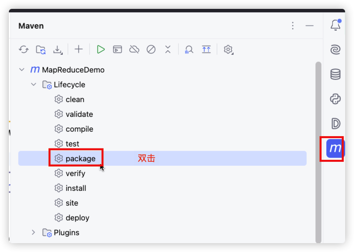

#### 2.2.2 执行开发的MR程序

1. 前置： 启动好hdfs、yarn

2. 上传打包的jar包到服务器上。

3. 执行启动命令 `hadoop jar MapReduceDemo-1.0-SNAPSHOT.jar com.demo.hadoop.mapreduce.wordcount.WordCountJob hdfs://192.168.56.101:9000/input/`，其中：

   - `hadoop jar` 是固定的命令开头，也可以写成`yarn jar`
   - `MapReduceDemo-1.0-SNAPSHOT.jar`是我们上个步骤打包好的程序包
   - `com.demo.hadoop.mapreduce.wordcount.WordCountJob` 这个是程序的入口（全限定名）
   - `hdfs://192.168.56.101:9000/input/` 是输入参数，有多少参数、参数的内容是什么取决于代码怎么写的。

4. 程序执行完后，会输出一些统计信息，用于分析任务是否符合预期。

   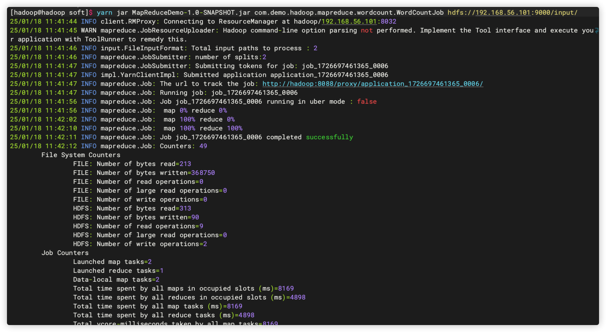

5. 另外，程序执行完，通常会有输出，需要检查输出是否正确。

### 2.3 YARN：资源调度

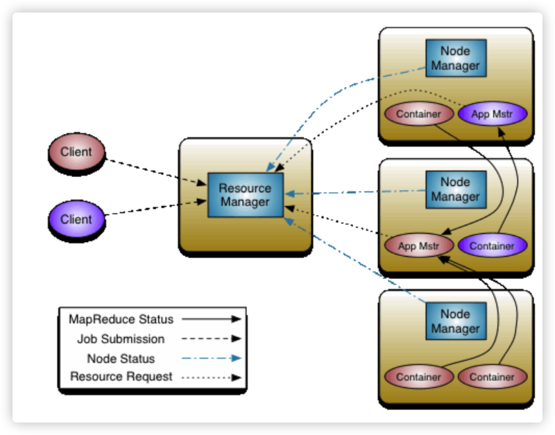

YARN 统一管理集群资源并分配给应用。ResourceManager 负责全局资源管理和调度，NodeManager 负责管理单个工作节点；应用的 ApplicationMaster 与任务容器协同完成作业运行。

#### 核心角色

- **ResourceManager（RM）**：全局资源管理与应用调度。Web UI 常见端口为 8088（Hadoop 2.x 默认值，可能被配置覆盖）。
- **NodeManager（NM）**：管理节点本地资源和容器，向 RM 汇报状态，并负责启动、监控容器。Web UI 常见端口为 8042。
- **ApplicationMaster（AM）**：每个应用通常有自己的 AM，负责与 RM 协商资源，并协调应用任务；MapReduce 作业使用 MRAppMaster。
- **Container**：YARN 分配的资源单元，描述运行任务所需的资源（如内存和 vCores）；NM 在其中启动应用进程。Container 不只是 JVM 环境的封装。

#### 作业提交与运行概览

1. 客户端向 RM 提交应用，RM 接收请求并启动 AM。
2. AM 向 RM 请求任务所需的 Container。
3. RM 的调度器根据队列和可用资源分配 Container，NM 随后启动任务进程。
4. AM 监控任务进度并处理任务级别的重试；应用完成后向 RM 汇报最终状态。


#### 启动 YARN

  `start-yarn.sh`

  `yarn.nodemanager.resource.memory-mb` 用于配置 NodeManager 可供 YARN 调度的内存。应结合操作系统、守护进程和容器开销规划资源，并同时设置合理的 vCore 数量；不要将全部物理内存分配给 YARN。硬件自动检测和未显式配置时的行为与 Hadoop 版本及配置有关，应以实际环境为准。

  ```xml
      <property>
          <name>yarn.nodemanager.resource.memory-mb</name>
          <value>3072</value>
      </property>
  ```

#### YARN 常用命令

  ```bash
  yarn jar <jar_path> <main_class> <input_path> <output_path>
  yarn application -list
  yarn application -status <application_id>
  yarn logs -applicationId <application_id> > /tmp/application.log
  
  
  ```

日志命令能否取回容器日志取决于集群的日志聚合配置和日志保留情况。排查失败任务时，可结合应用状态、RM/NM 日志及 History Server 查看。

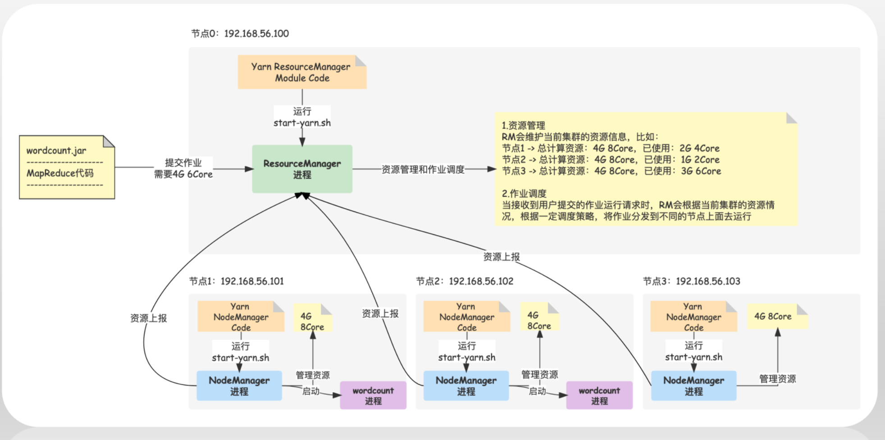

#### ResourceManager 的核心组成

1. **ResourceScheduler（资源调度器）**：根据调度策略为应用分配 Container。调度器负责资源分配，不负责监控应用进程或重启失败的 AM；这些职责由 RM 的其他部分和应用管理机制承担。常见调度器包括 FIFO、Capacity 和 Fair，具体可用项取决于发行版与配置。

   1. **FIFO（先进先出）**：按提交顺序调度，配置和理解简单；大集群多租户场景中，通常需要更细致的队列与资源隔离策略。

   2. **Capacity Scheduler（容量调度器）**：将资源划分到多个队列，可为队列配置容量和最大容量。空闲资源是否可被其他队列使用、以及队列内部如何排序，取决于调度器配置。

   3. **Fair Scheduler（公平调度器）**：根据队列、权重及公平策略在应用间分配资源。具体资源保障和上限由队列配置决定，不能仅凭“公平”推断每个应用会获得相同份额。

      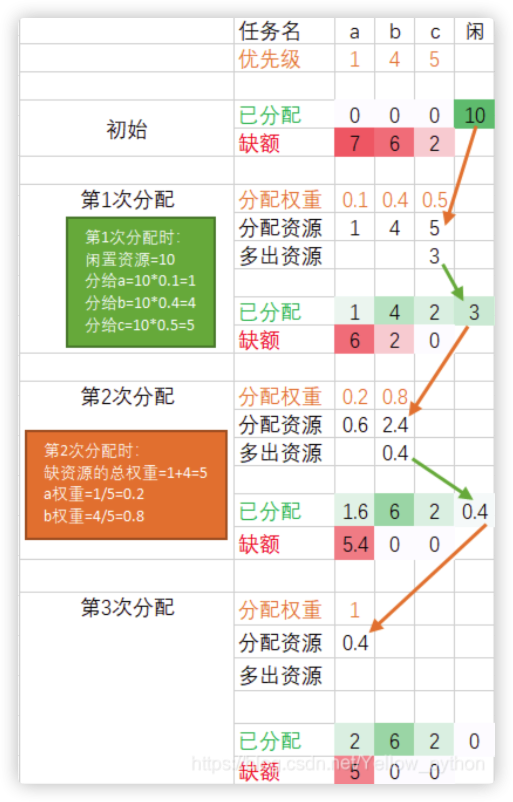

2. **ApplicationsManager（应用管理器）**：接收应用提交请求，并启动应用的第一个 Container（运行 AM）。AM 的重试行为受策略及最大尝试次数等配置控制，并非任何故障都会无条件自动重试。

   1. 每个 MapReduce 作业通常运行自己的 AM（MRAppMaster），并由它向 RM 申请作业所需的任务 Container、协调任务执行及汇总状态。

#### NodeManager

1. 定期向 ResourceManager 发送心跳和节点状态。
2. 接收启动 Container 的指令，启动并监控容器中的任务进程。

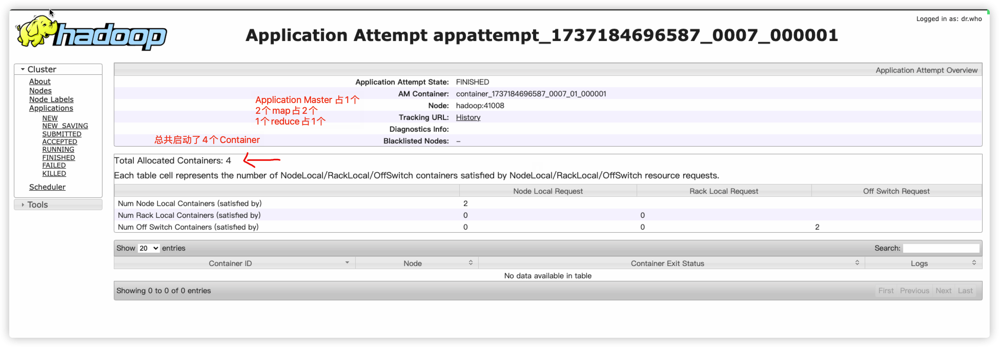

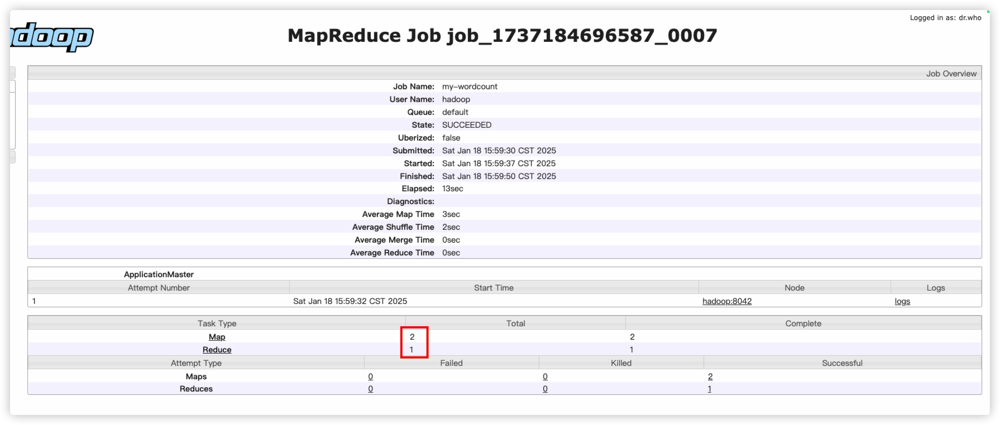

启动 JobHistory Server 后，可查看已完成 MapReduce 作业的历史信息：

`mr-jobhistory-daemon.sh start historyserver`

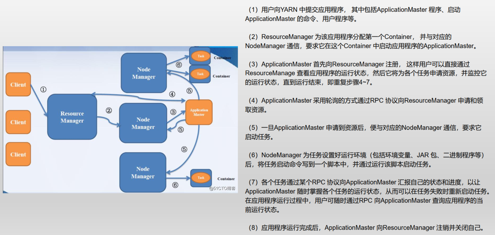

下面的实验配置中，`default` 和 `queueB` 的容量分别为 40% 和 60%，最大容量分别为 60% 和 80%。容量与最大容量是队列策略参数，实际可用资源还取决于集群资源及其他队列的使用情况。

修改容量调度器队列配置后，可在支持该操作的版本中运行 `yarn rmadmin -refreshQueues` 使配置生效；具体支持范围请核对对应版本文档。

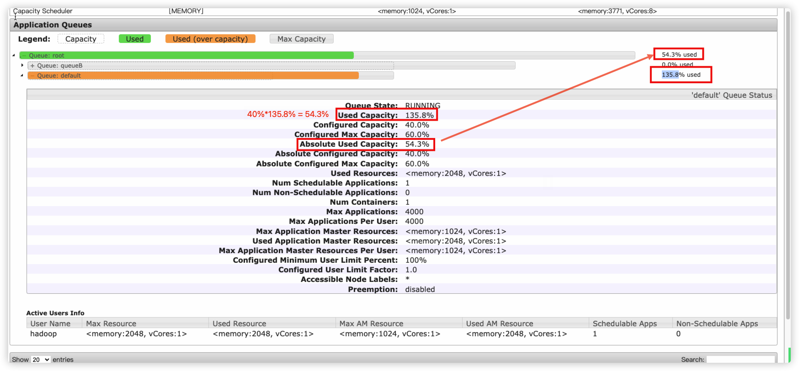

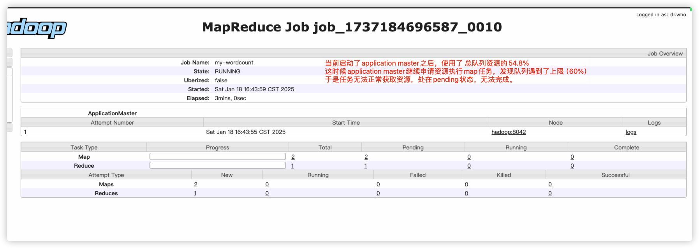

```bash
# 将 MapReduce 作业提交到指定队列（参数顺序按 Hadoop CLI 约定）
hadoop jar <jar_path> -Dmapreduce.job.queuename=queueB <main_class> <input_path> <output_path>
```

也可以在代码中设置作业队列：

```java
job.getConfiguration().set("mapreduce.job.queuename", "queueB");
```

如果队列无法获得所需资源，应先检查队列容量、最大容量、用户/应用限制及集群可用资源，再考虑调整队列配置或提交到其他队列。


## 3. 进阶原理

### 3.1 fsimage 与 edits

> 参考：https://zhuanlan.zhihu.com/p/363319862

```bash
## 查看fsimage内容
hdfs oiv -i fsimage_0000000000000005765 -o /tmp/fsimage_5765.xml -p XML
i: input
o: output
p:解析模式，可选 XML JSON DELIMITED

## 查看edits内容
hdfs oev -i edits_inprogress_0000000000000005770 -o /tmp/edits_5766.xml -p XML
i: input
o: output
p:解析模式，可选 XML JSON DELIMITED
```

`fsimage` 是文件系统命名空间在某个检查点的持久化快照，保存目录、文件、权限、块标识及副本数等元数据。它不记录块当前实际位于哪些 DataNode；NameNode 从 DataNode 心跳和块汇报中获得块位置。

```xml
<!-- 这是一个文件的元信息 -->
<inode>
  <id>16386</id>
  <type>FILE</type>
  <name>word.txt</name>
  <replication>1</replication>
  <mtime>1629507610356</mtime>
  <atime>1737169346717</atime>
  <perferredBlockSize>134217728</perferredBlockSize>
  <permission>hadoop:supergroup:rw-r--r--</permission>
  <blocks>
    <!-- 文件关联的数据块元数据；实际 DataNode 位置不保存在这里 -->
    <block>
      <id>1073741825</id>
      <genstamp>1001</genstamp>
      <numBytes>28</numBytes>
    </block> 
  </blocks> 
</inode>

<!-- 这是一个目录的元信息 -->
<inode>
  <id>17362</id>
  <type>DIRECTORY</type>
  <name>output1737169592927</name>
  <mtime>1737169618323</mtime>
  <permission>hadoop:supergroup:rwxr-xr-x</permission>
  <nsquota>-1</nsquota>
  <dsquota>-1</dsquota>
</inode>

```

`edits` 是 NameNode 的事务日志，按事务 ID 记录命名空间变更操作；它可用于恢复检查点之后的状态，但不是面向安全审计的完整访问日志。

```xml
<?xml version="1.0" encoding="UTF-8"?>
<EDITS>
  <EDITS_VERSION>-63</EDITS_VERSION>
  <RECORD>
    <OPCODE>OP_START_LOG_SEGMENT</OPCODE>
    <DATA>
      <TXID>5770</TXID>
    </DATA>
  </RECORD>
  <RECORD>
    <OPCODE>OP_ADD</OPCODE>
    <DATA>
      <TXID>5771</TXID>
      <LENGTH>0</LENGTH>
      <INODEID>17811</INODEID>
      <PATH>/MapReduceDemo-1.0-SNAPSHOT.jar._COPYING_</PATH>
      <REPLICATION>1</REPLICATION>
      <MTIME>1737252260224</MTIME>
      <ATIME>1737252260224</ATIME>
      <BLOCKSIZE>134217728</BLOCKSIZE>
      <CLIENT_NAME>DFSClient_NONMAPREDUCE_-912616906_1</CLIENT_NAME>
      <CLIENT_MACHINE>192.168.56.101</CLIENT_MACHINE>
      <OVERWRITE>true</OVERWRITE>
      <PERMISSION_STATUS>
        <USERNAME>hadoop</USERNAME>
        <GROUPNAME>supergroup</GROUPNAME>
        <MODE>420</MODE>
      </PERMISSION_STATUS>
      <RPC_CLIENTID>2b985494-6c70-4ec3-9229-d5bf3e7ab5d4</RPC_CLIENTID>
      <RPC_CALLID>3</RPC_CALLID>
    </DATA>
  </RECORD>
  <RECORD>
    <OPCODE>OP_ALLOCATE_BLOCK_ID</OPCODE>
    <DATA>
      <TXID>5772</TXID>
      <BLOCK_ID>1073742464</BLOCK_ID>
    </DATA>
  </RECORD>
  <RECORD>
    <OPCODE>OP_SET_GENSTAMP_V2</OPCODE>
    <DATA>
      <TXID>5773</TXID>
      <GENSTAMPV2>1646</GENSTAMPV2>
    </DATA>
  </RECORD>
  <RECORD>
    <OPCODE>OP_ADD_BLOCK</OPCODE>
    <DATA>
      <TXID>5774</TXID>
      <PATH>/MapReduceDemo-1.0-SNAPSHOT.jar._COPYING_</PATH>
      <BLOCK>
        <BLOCK_ID>1073742464</BLOCK_ID>
        <NUM_BYTES>0</NUM_BYTES>
        <GENSTAMP>1646</GENSTAMP>
      </BLOCK>
      <RPC_CLIENTID></RPC_CLIENTID>
      <RPC_CALLID>-2</RPC_CALLID>
    </DATA>
  </RECORD>
  <RECORD>
    <OPCODE>OP_CLOSE</OPCODE>
    <DATA>
      <TXID>5775</TXID>
      <LENGTH>0</LENGTH>
      <INODEID>0</INODEID>
      <PATH>/MapReduceDemo-1.0-SNAPSHOT.jar._COPYING_</PATH>
      <REPLICATION>1</REPLICATION>
      <MTIME>1737252260547</MTIME>
      <ATIME>1737252260224</ATIME>
      <BLOCKSIZE>134217728</BLOCKSIZE>
      <CLIENT_NAME></CLIENT_NAME>
      <CLIENT_MACHINE></CLIENT_MACHINE>
      <OVERWRITE>false</OVERWRITE>
      <BLOCK>
        <BLOCK_ID>1073742464</BLOCK_ID>
        <NUM_BYTES>5368</NUM_BYTES>
        <GENSTAMP>1646</GENSTAMP>
      </BLOCK>
      <PERMISSION_STATUS>
        <USERNAME>hadoop</USERNAME>
        <GROUPNAME>supergroup</GROUPNAME>
        <MODE>420</MODE>
      </PERMISSION_STATUS>
    </DATA>
  </RECORD>
  <RECORD>
    <OPCODE>OP_RENAME_OLD</OPCODE>
    <DATA>
      <TXID>5776</TXID>
      <LENGTH>0</LENGTH>
      <SRC>/MapReduceDemo-1.0-SNAPSHOT.jar._COPYING_</SRC>
      <DST>/MapReduceDemo-1.0-SNAPSHOT.jar</DST>
      <TIMESTAMP>1737252260554</TIMESTAMP>
      <RPC_CLIENTID>2b985494-6c70-4ec3-9229-d5bf3e7ab5d4</RPC_CLIENTID>
      <RPC_CALLID>8</RPC_CALLID>
    </DATA>
  </RECORD>
</EDITS>

```

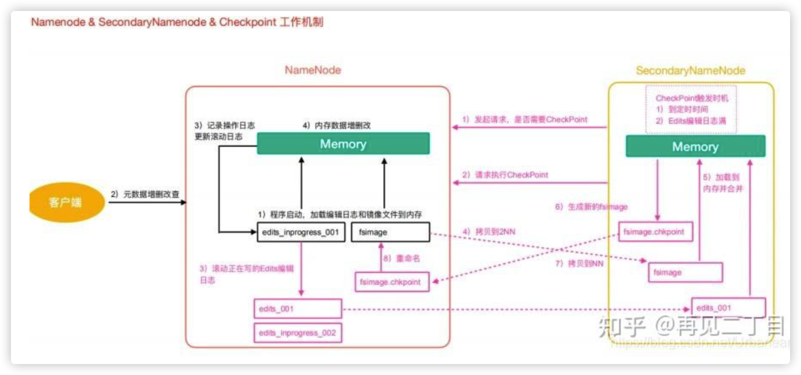

#### Secondary NameNode 与检查点

在非 HA 模式中，Secondary NameNode 会定期执行 checkpoint：

1. 获取当前 `fsimage` 和尚未应用的 `edits`。
2. 合并并生成新的检查点，减少 NameNode 重启时需要重放的日志量。
3. 将新检查点交回 NameNode，并允许清理已合并的旧日志。

> Secondary NameNode 不是 NameNode 的热备节点，也不会在 NameNode 故障时自动接管。检查点可用于辅助恢复元数据，但不能替代 HA、备份或灾难恢复方案。

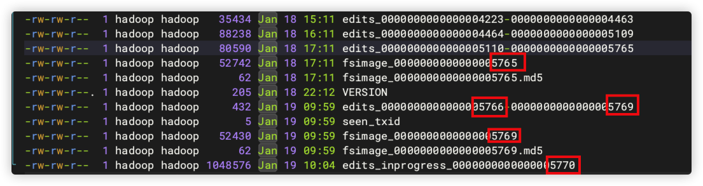

`fsimage_0000000000000005765 + edits_0000000000000005766-0000000000000005769 进行合并 = fsimage_0000000000000005769`

checkpoint相关配置：

https://hadoop.apache.org/docs/r2.10.2/hadoop-project-dist/hadoop-hdfs/hdfs-default.xml

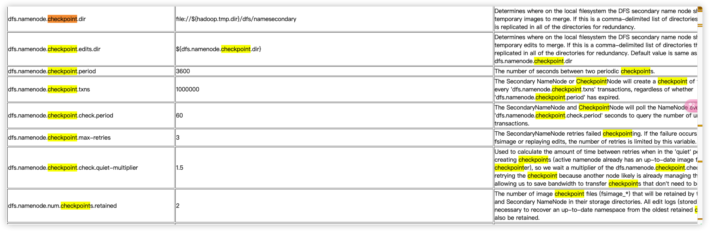


### 3.2 HDFS 高可用

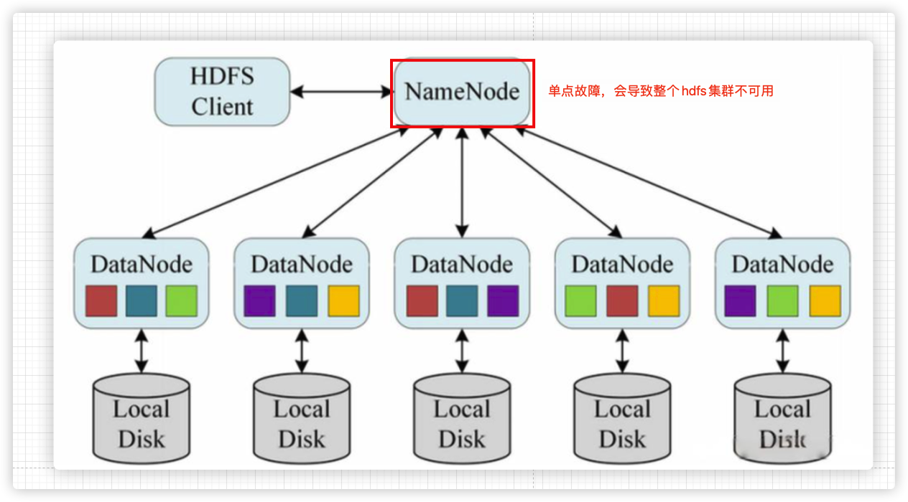

为减少 NameNode 单点故障，可部署一对 NameNode：Active 处理客户端请求，Standby 持续同步元数据并在故障转移时接管。

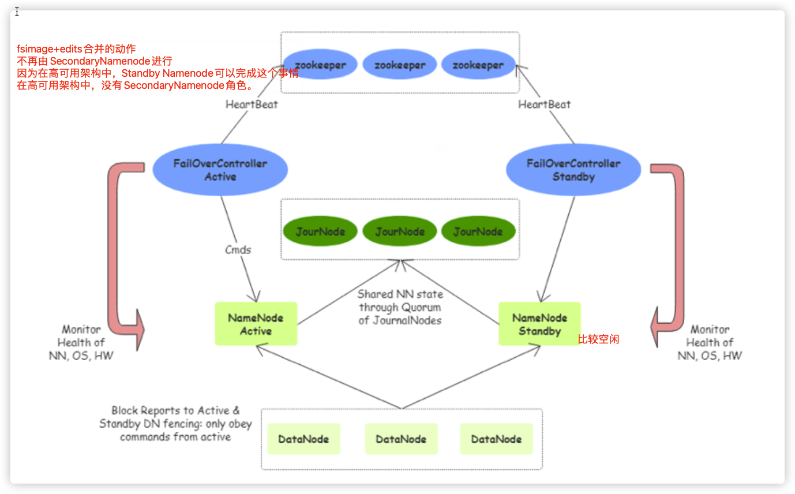

#### HA 组件与故障转移

1. **Active NameNode**：处理文件系统元数据请求，并将命名空间变更写入 JournalNode 集群。
2. **Standby NameNode**：读取并应用共享的 edits，保持命名空间状态同步；故障转移后可成为 Active。
3. **JournalNode**：组成共享 edits 的多数派服务。通常部署奇数个节点以维持可用的多数派。
4. **ZKFC（ZooKeeper Failover Controller）**：监控 NameNode 健康状态，并在启用自动故障转移时协调切换。还需配置 fencing，避免原 Active 在隔离失败时继续处理写请求。

HA 客户端通常通过逻辑 nameservice URI 和 failover proxy provider 访问 HDFS，而不是固定连接某台 NameNode。HA 配置中由 Standby 承担检查点相关工作，不需要另外启动 Secondary NameNode。

## 附录

### 集群与分布式

**集群**：由多个独立的计算机（物理或虚拟节点）通过网络连接组成，对外提供协同服务。集群常用于扩展容量、吞吐量或可用性。

**分布式系统**：将数据或计算任务分布到多个节点，并通过网络协作完成整体目标。集群描述节点组织方式，分布式描述系统的处理方式；二者相关但并非同义词。

常见的分布式能力包括：

- 分布式存储
- 分布式计算
- 分布式资源调度与管理

### 网络

网络使不同主机能够交换数据并协同完成任务。理解以下概念有助于排查 Hadoop 节点之间的连接问题：

- **IP 地址**：标识网络接口，用于定位主机或接口。
- **主机名 / 域名**：便于记忆的名称，通常需要通过 DNS 或本地 hosts 配置解析为 IP。
- **端口**：标识主机上由某个进程提供的网络服务；能连接到主机并不代表目标端口上的服务可用。
- Linux 上可用 `ss -lntp` 查看 TCP 监听端口；旧环境也可能使用 `netstat -naltp`。可用 `nc -vz <host> <port>` 测试 TCP 连通性。
- 连接失败时，依次检查主机名解析、网络路由/防火墙、目标端口是否监听，以及服务端日志。

### Hadoop 常用端口

以下为 Hadoop 2.x 环境中常见的默认端口，并非固定值。版本、发行版和配置都可能改变端口；集群部署时应以对应版本的配置文件及实际监听状态为准。

| 组件     | 节点                | 常见端口  | 配置                                          | 用途说明                                                    |
| -------- | ------------------- | --------- | --------------------------------------------- | ----------------------------------------------------------- |
| HDFS     | DataNode            | 50010     | dfs.datanode.address                          | datanode服务端口，用于数据传输                              |
| HDFS     | DataNode            | 50075     | dfs.datanode.http.address                     | http服务的端口                                              |
| HDFS     | DataNode            | 50475     | dfs.datanode.https.address                    | https服务的端口                                             |
| HDFS     | DataNode            | 50020     | dfs.datanode.ipc.address                      | ipc服务的端口                                               |
| **HDFS** | **NameNode**        | **50070** | **dfs.namenode.http-address**                 | **http服务的端口**                                          |
| HDFS     | NameNode            | 50470     | dfs.namenode.https-address                    | https服务的端口                                             |
| **HDFS** | **NameNode**        | **9000**  | **fs.defaultFS**                              | **接收Client连接的RPC端口，用于获取文件系统metadata信息。** |
| HDFS     | SecondaryNameNode   | 9001      | dfs.namenode.secondary.http-address           | secondary namenodehttp服务的端口                            |
| HDFS     | journalnode         | 8485      | dfs.journalnode.rpc-address                   | RPC服务                                                     |
| HDFS     | journalnode         | 8480      | dfs.journalnode.http-address                  | HTTP服务                                                    |
| HDFS     | ZKFC                | 8019      | dfs.ha.zkfc.port                              | ZooKeeper FailoverController，用于NN HA                     |
| YARN     | ResourceManager     | 8032      | yarn.resourcemanager.address                  | RM的applications manager(ASM)端口                           |
| YARN     | ResourceManager     | 8030      | yarn.resourcemanager.scheduler.address        | scheduler组件的IPC端口                                      |
| YARN     | ResourceManager     | 8031      | yarn.resourcemanager.resource-tracker.address | IPC                                                         |
| YARN     | ResourceManager     | 8033      | yarn.resourcemanager.admin.address            | IPC                                                         |
| **YARN** | **ResourceManager** | **8088**  | **yarn.resourcemanager.webapp.address**       | **http服务端口**                                            |
| YARN     | NodeManager         | 8040      | yarn.nodemanager.localizer.address            | localizer IPC                                               |
| YARN     | NodeManager         | 8042      | yarn.nodemanager.webapp.address               | http服务端口                                                |
| YARN     | NodeManager         | 8041      | yarn.nodemanager.address                      | NM中container manager的端口                                 |
| YARN     | JobHistory Server   | 10020     | mapreduce.jobhistory.address                  | IPC                                                         |
| YARN     | JobHistory Server   | 19888     | mapreduce.jobhistory.webapp.address           | http服务端口                                                |


### 集群角色规划

示例：4 节点部署。NameNode 的 Standby 仅用于 HA 部署；非 HA 部署可将该位置改为 Secondary NameNode。ResourceManager 同理，Standby RM 需要配置 YARN HA。

| 角色                    | 节点1（16 GB / 8 vCores） | 节点2（256 GB / 128 vCores） | 节点3（256 GB / 128 vCores） | 节点4（256 GB / 128 vCores） |
| ----------------------- | ------------------------ | ---------------------------- | ---------------------------- | ---------------------------- |
| NameNode（Active）      | ✅                        |                              |                              |                              |
| NameNode（Standby，HA） |                          |                              |                              | ✅（二选一）                  |
| Secondary NameNode（非 HA） |                       |                              |                              | ✅（二选一）                  |
| DataNode                |                          | ✅                            | ✅                            | ✅                            |
| ResourceManager（Active） | ✅                      |                              |                              |                              |
| ResourceManager（Standby，HA） |                    |                              | ✅                            |                              |
| NodeManager             |                          | ✅                            | ✅                            | ✅                            |


简化的单节点学习环境（不具备生产级容错能力）：

| 角色              | 节点1（192.168.56.101） |
| ----------------- | ----------------------- |
| NameNode          | ✅                       |
| DataNode          | ✅                       |
| SecondaryNamenode | ✅                       |
| ResourceManager   | ✅                       |
| NodeManager       | ✅                       |

### 启动与停止命令

```bash
## 查看环境变量配置
cat ~/.bash_profile

## 按集群配置启动 HDFS 和 YARN
start-dfs.sh
start-yarn.sh

## 同时启动配置中的 Hadoop 服务
start-all.sh

stop-dfs.sh
stop-yarn.sh
stop-all.sh
```

启动脚本依赖正确的配置、主机名解析和 SSH 免密访问。若服务未正常启动，优先检查对应进程日志，并确认端口没有被占用。

```bash
# 检查环境变量，并查看常见 Hadoop 日志目录（具体位置因部署而异）
echo "${HADOOP_LOG_DIR:-未设置}"
find "$HADOOP_HOME/logs" -maxdepth 1 -type f -print
```
