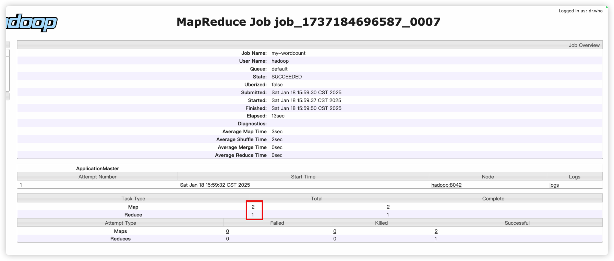

# Apache Hadoop

## 一、简介

什么是hadoop？

- 狭义上讲，hadoop指的是Apache Hadoop这个软件。是大数据的基石。
- 由Apache基金会开发的分布式系统基础架构。它允许用户在不了解分布式底层细节的情况下，开发分布式计算程序，从而解决分布式计算问题。另外，通过Hadoop的分布式存储能力，解决海量数据存储的问题。
  - 分布式存储
  - 分布式计算框架
  - 分布式资源调度

- 广义上讲，Hadoop指的是一个大数据的生态圈
  - hbase、hive、spark、flink、zookeeper、kafka....
  - elasticsearch、clickhouse、doris

## 二、基本原理和操作

### 2.1 分布式存储服务

HDFS：（Hadoop filesystem）

`start-dfs.sh`： 启动分布式文件存储服务。


- Namenode：负责管理文件系统的命名空间（文件和目录），维护文件系统的元数据，比如文件数和文件的权限等。也是整个hdfs集群的管理者。
- Datanode：负责存储实际的数据块，以及执行数据块的读/写操作，以满足客户端和Namenode的请求。是hdfs中真正保存数据的角色。

因为hdfs本身是一个分布式的文件系统，在访问这个文件系统的时候，所有命令都需要添加hadoop fs 前缀来访问。如果不带上hadoop fs前缀，操作的就是linux的文件系统，注意区分。

当我们通过 `hadoop fs -ls /`命令访问根目录时，实际上它访问的是`hadoop fs -ls hdfs://192.168.56.101:9000/`。

hdfs://192.168.56.101:9000/

hdfs 是固定的协议，所以可以省略

192.168.56.101:9000 这个是ip和端口，告诉hadoop客户端访问的是哪个hdfs。这部分实际上配置在配置文件(/home/hadoop/app/hadoop/etc/hadoop/core-site.xml)中，当没有指定时，就按照配置文件中的地址进行访问，所以也可以省略。


```bash
# 上传文件
hadoop fs -put test.txt /
# 下载文件
hadoop fs -get /test.txt 

## cat mkdir get put mv rm du cp

hadoop fs 
Usage: hadoop fs [generic options]
        [-appendToFile <localsrc> ... <dst>]
        [-cat [-ignoreCrc] <src> ...]
        [-checksum <src> ...]
        [-chgrp [-R] GROUP PATH...]
        [-chmod [-R] <MODE[,MODE]... | OCTALMODE> PATH...]
        [-chown [-R] [OWNER][:[GROUP]] PATH...]
        [-copyFromLocal [-f] [-p] [-l] <localsrc> ... <dst>]
        [-copyToLocal [-p] [-ignoreCrc] [-crc] <src> ... <localdst>]
        [-count [-q] [-h] <path> ...]
        [-cp [-f] [-p | -p[topax]] <src> ... <dst>]
        [-createSnapshot <snapshotDir> [<snapshotName>]]
        [-deleteSnapshot <snapshotDir> <snapshotName>]
        [-df [-h] [<path> ...]]
        [-du [-s] [-h] <path> ...]
        [-expunge]
        [-find <path> ... <expression> ...]
        [-get [-p] [-ignoreCrc] [-crc] <src> ... <localdst>]
        [-getfacl [-R] <path>]
        [-getfattr [-R] {-n name | -d} [-e en] <path>]
        [-getmerge [-nl] <src> <localdst>]
        [-help [cmd ...]]
        [-ls [-d] [-h] [-R] [<path> ...]]
        [-mkdir [-p] <path> ...]
        [-moveFromLocal <localsrc> ... <dst>]
        [-moveToLocal <src> <localdst>]
        [-mv <src> ... <dst>]
        [-put [-f] [-p] [-l] <localsrc> ... <dst>]
        [-renameSnapshot <snapshotDir> <oldName> <newName>]
        [-rm [-f] [-r|-R] [-skipTrash] <src> ...]
        [-rmdir [--ignore-fail-on-non-empty] <dir> ...]
        [-setfacl [-R] [{-b|-k} {-m|-x <acl_spec>} <path>]|[--set <acl_spec> <path>]]
        [-setfattr {-n name [-v value] | -x name} <path>]
        [-setrep [-R] [-w] <rep> <path> ...]
        [-stat [format] <path> ...]
        [-tail [-f] <file>]
        [-test -[defsz] <path>]
        [-text [-ignoreCrc] <src> ...]
        [-touchz <path> ...]
        [-truncate [-w] <length> <path> ...]
        [-usage [cmd ...]]


```


数据块和副本

在hdfs当中，文件块/数据块（block）是最基本的存储单位。对于文件而言，文件的大小可以小于一个块，也可以大于一个块。文件的大小称之为size，当一个文件超过默认的块大小时（128MB），那么这个文件就会被切割成几个数据块。数据块在linux服务器的存储路径：`/home/hadoop/data/dn/current/BP-526458200-192.168.56.101-1629506932865/current/finalized/subdir0`

数据块最大大小固定是128MB（可配置），但是在真实的linux存储路径上，数据块会议真实的大小进行保存

副本：通过冗余多份（默认3份）数据，保障当有部分节点出现异常时，不影响整体的读写功能。这就是所谓的副本机制保证高可用性。

为什么要切成相同大小的block?

1. 为了支持大文件的存储：hdfs被设计为用于存储和处理大规模数据（TB级别甚至PB级别）。将文件切成数据块，有利于有效的突破单个机器的存储限制。
2. 为了能够支持高效的存储和读取效率：多个数据块存储到不同的节点（磁盘）上，可以并行处理，从而为并行计算提供了可能性。
3. 副本机制：保证数据高可用，增加容错性
4. 支持动态扩展：当集群需要扩展时，可以平滑的增加存储和计算能力，无需进行大规模数据迁移。

#### 2.1.1 hdfs的写流程


上传一个文件： `hadoop fs -put wordcount.txt /tmp`

注意：真正在上传数据的时候，是不需要经过Namenode进行传输的，是由客户端直接和datanode发起网络连接进行上传。

#### 2.1.2 hdfs的读流程


读取/下载一个文件：`hadoop fs -get /tmp/wordcount.txt /tmp/`

注意： 读取文件块的时候，同样是直接找到**最近**的datanode（多个副本，找距离最近的）进行读取，不需要经过namenode转发流量。


### 2.2 分布式计算框架

MapReduce 是一种分布式计算模型，由Google公司提出，解决**海量数据**的计算问题。

由两部分组成：Map和Reduce。我们有了hadoop中的MapReduce框架后，开发一个分布式计算的程序就变得非常简单。我们开发一个基于MapReduce计算框架的分布式计算式计算程序时，只需要实现 map() 接口和reduce()接口，实现在不同的节点上处理部分数据的功能即可。

MapReduce的工作流程主要分为三个阶段：Map、Shuffle和Reduce。

MapReduce的核心思想是分（分布式计算）而治（合并结果）之。

- map阶段，数据的数据会被分片并格式化为键值对，随后每个map任务回并行处理这些数据。
- shuffle阶段，shuffle负责将map输出的数据进行排序和分配，确保相同的键被发送到同一个Reduce任务中
- Reduce阶段，将shuffle发送过来的数据进行汇总并输出，完成整个数据处理结果输出。

#### 2.2.1 基本开发流程


参考 网盘中的  代码目录下的项目

1. 创建maven项目，添加hadoop-client依赖包

   ```xml
       <dependency>
         <groupId>org.apache.hadoop</groupId>
         <artifactId>hadoop-client</artifactId>
         <version>2.7.7</version>
       </dependency>
   ```

2. 创建mapper类，实现map接口，完成map的业务逻辑

   1. 创建类，继承 `org.apache.hadoop.mapreduce.Mapper`
   2. 实现`org.apache.hadoop.mapreduce.Mapper#map`接口 （鼠标右键--> generate.. --> overwrite methods..）
   3. 接口中实现业务逻辑

3. 创建Reducer，实现reduce接口，完成reduce的业务逻辑

   1. 创建类，继承 `org.apache.hadoop.mapreduce.Reducer`
   2. 实现`org.apache.hadoop.mapreduce.Reducer#reduce`接口 （鼠标右键--> generate.. --> overwrite methods..）
   3. 接口中实现业务逻辑

4. 创建主程序（job程序），将map和reduce串起来，并且指定输入和输出路径、其他配置。

5. 打包并执行程序。

   `mvn clean package`


#### 2.2.2 执行开发的MR程序

1. 前置： 启动好hdfs、yarn

2. 上传打包的jar包到服务器上。

3. 执行启动命令 `hadoop jar MapReduceDemo-1.0-SNAPSHOT.jar com.demo.hadoop.mapreduce.wordcount.WordCountJob hdfs://192.168.56.101:9000/input/`，其中：

   - `hadoop jar` 是固定的命令开头，也可以写成`yarn jar`
   - `MapReduceDemo-1.0-SNAPSHOT.jar`是我们上个步骤打包好的程序包
   - `com.demo.hadoop.mapreduce.wordcount.WordCountJob` 这个是程序的入口（全限定名）
   - `hdfs://192.168.56.101:9000/input/` 是输入参数，有多少参数、参数的内容是什么取决于代码怎么写的。

4. 程序执行完后，会输出一些统计信息，用于分析任务是否符合预期。

   

5. 另外，程序执行完，通常会有输出，需要检查输出是否正确。

### 2.3 分布式资源调度


分布式资源调度器本身也是主从架构的，ResourceManager是整个集群的管理者，NodeManager是每个计算节点上的管理者

ResourceManager（端口8088）

1. 资源管理（掌握整个计算集群的资源情况） 
2. 作业的调度（接收提交作业请求，合理的调度作业）

NodeManager（端口8042）

1. 管理单个节点上的资源
2. 真正的运行用户代码

Container

Container也叫做容器，是yarn上面的一个资源的抽象概念，它是资源和运行环境的封装（jvm环境）。是为了量化计算资源而产生的概念。


- yarn的启动命令

  `start-yarn.sh`

  当`yarn.nodemanager.resource.detect-hardware-capabilities`（默认false）配置为true时，并且	`yarn.nodemanager.resource.memory-mb`	配置为-1 时，NodeManager（默认-1）默认内存会设置为8192MB（可能和实际内存不符）

  通常可以配置yarn-site中对NodeManager内存的大小

  测试环境可以稍微配大一点（超配），生产环境建议保守一点，一般为服务器总内存的80%~90%左右即可。

  ```xml
      <property>
          <name>yarn.nodemanager.resource.memory-mb</name>
          <value>3072</value>
      </property>
  ```

- yarn的基本命令

  ```bash
  yarn jar # 提交MR任务，等同于hadoop jar
  yarn application # 查看任务相关信息
  yarn logs # 查看作业的日志，经常用于任务失败后的排查
  yarn logs -applicationId application_1737184696587_0002 > /tmp/application_1737184696587_0002.log # 会输出所有的map和reduce任务的日志，以及APP master的日志。通常会重定向到一个文件中，再通过vim/less之类的命令查看日志。
  yarn container
  
  
  yarn application 
  25/01/18 15:25:45 INFO client.RMProxy: Connecting to ResourceManager at hadoop/192.168.56.101:8032
  Invalid Command Usage : 
  usage: application
   -appStates <States>             Works with -list to filter applications
                                   based on input comma-separated list of
                                   application states. The valid application
                                   state can be one of the following:
                                   ALL,NEW,NEW_SAVING,SUBMITTED,ACCEPTED,RUN
                                   NING,FINISHED,FAILED,KILLED
   -appTypes <Types>               Works with -list to filter applications
                                   based on input comma-separated list of
                                   application types.
   -help                           Displays help for all commands.
   -kill <Application ID>          Kills the application.
   -list                           List applications. Supports optional use
                                   of -appTypes to filter applications based
                                   on application type, and -appStates to
                                   filter applications based on application
                                   state.
   -movetoqueue <Application ID>   Moves the application to a different
                                   queue.
   -queue <Queue Name>             Works with the movetoqueue command to
                                   specify which queue to move an
                                   application to.
   -status <Application ID>        Prints the status of the application.
  ```


ResourceManager的核心组成：

1. ResourceScheduler（资源调度器），主要负责协调集群中各个应用的资源分配，保证整个集群的运行效率。ResourceScheduler只是一个纯调度器，只负责给用户提交的应用程序分配Container（资源），并不会关注应用程序的运行状态信息/监控信息。换句话说，如果一个任务运行失败了，ResourceScheduler不会负责重启应用程序。在yarn中，有多种任务的调度算法（调度器）

   1. FIFO（先进先出）：多个任务同时请求时，如果资源不够启动所有任务，那么谁先提交，就先运行。（最简单直观，但是生产几乎不用）缺少对资源的合理分配，没有考虑每个任务的优先级、等待时间、资源需求量等。

   2. 容量调度器（capacity scheduler）：将资源划分成多个不同的队列，不同的任务可以划分到不同的队列上运行，互相不干扰。当某个队列任务排队较多，而其他队列较为空闲时，可以将空闲队列的资源暂时借给繁忙的队列使用（借用多少取决于配置）。 每个队列内部还是采用FIFO的方式进行调度。

   3. 公平调度器（Fair scheduler）：公平调度是一种向应用程序分配资源的方法，以便所有**应用程序随着时间的推移平均获得平等的资源**份额。相对公平、按照权重分配，**无法控制绝对的资源百分比**。

      

2. ApplicationManager（应用管理器），主要负责接收用户提交的请求，为应用程序**分配第一个Container**来运行任务的application master，另外就是负责监控application master，当application master遇到异常情况时，ApplicationManager会自动帮我们重试application master。

   1. application master是每个MapReduce程序都会有的，运行在Container，会负责将整个MapReduce任务所需要的资源向ResourceScheduler提出申请。可以看作是开发者对资源控制的入口。

NodeManager

1. 定时心跳上报节点资源使用情况
2. 接收到ResourceManager的启动Container请求后，负责启动Container，执行运算任务。




为了方便查看任务的运行历史情况，可以启动一个 historyServer的服务

`mr-jobhistory-daemon.sh start historyserver`


根据容量调度器的配置，default和queueB分别占用40%（最大60%）和60%（最大80%）的资源

修改队列资源不需要重启ResourceManager，只需要执行`yarn rmadmin -refreshQueues` 即可。


无奈，只能kill掉，然后加大资源，或者换其他队列。


```bash
## 指定队列执行任务
hadoop jar MapReduceDemo-1.0-SNAPSHOT.jar com.demo.hadoop.mapreduce.wordcount.WordCountJob hdfs://192.168.56.101:9000/input/ -Dmapreduce.job.queuename=queueB  
# 也可以在代码中配置队列，但是不太推荐。
        job.getConfiguration().set("mapreduce.job.queuename","queueB");


## 第二种方式，把队列资源调大
  <property>
    <name>yarn.scheduler.capacity.root.default.maximum-capacity</name>
    <value>100</value>
    <description>
      The maximum capacity of the default queue. 
    </description>
  </property>
```


## 三、 进阶

### 3.1 fsimage和edits

> 参考：https://zhuanlan.zhihu.com/p/363319862

```bash
## 查看fsimage内容
hdfs oiv -i fsimage_0000000000000005765 -o /tmp/fsimage_5765.xml -p XML
i: input
o: output
p:解析模式，可选 XML JSON DELIMITED

## 查看edits内容
hdfs oev -i edits_inprogress_0000000000000005770 -o /tmp/edits_5766.xml -p XML
i: input
o: output
p:解析模式，可选 XML JSON DELIMITED
```

namenode存储的元信息（fsimage文件）：有什么文件、分了多少个块、权限规则、多少个副本、更新时间...

```xml
<!-- 这是一个文件的元信息 -->
<inode>
  <id>16386</id>
  <type>FILE</type>
  <name>word.txt</name>
  <replication>1</replication>
  <mtime>1629507610356</mtime>
  <atime>1737169346717</atime>
  <perferredBlockSize>134217728</perferredBlockSize>
  <permission>hadoop:supergroup:rw-r--r--</permission>
  <blocks>
    <!-- 数据块放在哪个节点上？ -->
    <block>
      <id>1073741825</id>
      <genstamp>1001</genstamp>
      <numBytes>28</numBytes>
    </block> 
  </blocks> 
</inode>

<!-- 这是一个目录的元信息 -->
<inode>
  <id>17362</id>
  <type>DIRECTORY</type>
  <name>output1737169592927</name>
  <mtime>1737169618323</mtime>
  <permission>hadoop:supergroup:rwxr-xr-x</permission>
  <nsquota>-1</nsquota>
  <dsquota>-1</dsquota>
</inode>

```

edits文件记录了操作的过程

可以用于审计

```xml
<?xml version="1.0" encoding="UTF-8"?>
<EDITS>
  <EDITS_VERSION>-63</EDITS_VERSION>
  <RECORD>
    <OPCODE>OP_START_LOG_SEGMENT</OPCODE>
    <DATA>
      <TXID>5770</TXID>
    </DATA>
  </RECORD>
  <RECORD>
    <OPCODE>OP_ADD</OPCODE>
    <DATA>
      <TXID>5771</TXID>
      <LENGTH>0</LENGTH>
      <INODEID>17811</INODEID>
      <PATH>/MapReduceDemo-1.0-SNAPSHOT.jar._COPYING_</PATH>
      <REPLICATION>1</REPLICATION>
      <MTIME>1737252260224</MTIME>
      <ATIME>1737252260224</ATIME>
      <BLOCKSIZE>134217728</BLOCKSIZE>
      <CLIENT_NAME>DFSClient_NONMAPREDUCE_-912616906_1</CLIENT_NAME>
      <CLIENT_MACHINE>192.168.56.101</CLIENT_MACHINE>
      <OVERWRITE>true</OVERWRITE>
      <PERMISSION_STATUS>
        <USERNAME>hadoop</USERNAME>
        <GROUPNAME>supergroup</GROUPNAME>
        <MODE>420</MODE>
      </PERMISSION_STATUS>
      <RPC_CLIENTID>2b985494-6c70-4ec3-9229-d5bf3e7ab5d4</RPC_CLIENTID>
      <RPC_CALLID>3</RPC_CALLID>
    </DATA>
  </RECORD>
  <RECORD>
    <OPCODE>OP_ALLOCATE_BLOCK_ID</OPCODE>
    <DATA>
      <TXID>5772</TXID>
      <BLOCK_ID>1073742464</BLOCK_ID>
    </DATA>
  </RECORD>
  <RECORD>
    <OPCODE>OP_SET_GENSTAMP_V2</OPCODE>
    <DATA>
      <TXID>5773</TXID>
      <GENSTAMPV2>1646</GENSTAMPV2>
    </DATA>
  </RECORD>
  <RECORD>
    <OPCODE>OP_ADD_BLOCK</OPCODE>
    <DATA>
      <TXID>5774</TXID>
      <PATH>/MapReduceDemo-1.0-SNAPSHOT.jar._COPYING_</PATH>
      <BLOCK>
        <BLOCK_ID>1073742464</BLOCK_ID>
        <NUM_BYTES>0</NUM_BYTES>
        <GENSTAMP>1646</GENSTAMP>
      </BLOCK>
      <RPC_CLIENTID></RPC_CLIENTID>
      <RPC_CALLID>-2</RPC_CALLID>
    </DATA>
  </RECORD>
  <RECORD>
    <OPCODE>OP_CLOSE</OPCODE>
    <DATA>
      <TXID>5775</TXID>
      <LENGTH>0</LENGTH>
      <INODEID>0</INODEID>
      <PATH>/MapReduceDemo-1.0-SNAPSHOT.jar._COPYING_</PATH>
      <REPLICATION>1</REPLICATION>
      <MTIME>1737252260547</MTIME>
      <ATIME>1737252260224</ATIME>
      <BLOCKSIZE>134217728</BLOCKSIZE>
      <CLIENT_NAME></CLIENT_NAME>
      <CLIENT_MACHINE></CLIENT_MACHINE>
      <OVERWRITE>false</OVERWRITE>
      <BLOCK>
        <BLOCK_ID>1073742464</BLOCK_ID>
        <NUM_BYTES>5368</NUM_BYTES>
        <GENSTAMP>1646</GENSTAMP>
      </BLOCK>
      <PERMISSION_STATUS>
        <USERNAME>hadoop</USERNAME>
        <GROUPNAME>supergroup</GROUPNAME>
        <MODE>420</MODE>
      </PERMISSION_STATUS>
    </DATA>
  </RECORD>
  <RECORD>
    <OPCODE>OP_RENAME_OLD</OPCODE>
    <DATA>
      <TXID>5776</TXID>
      <LENGTH>0</LENGTH>
      <SRC>/MapReduceDemo-1.0-SNAPSHOT.jar._COPYING_</SRC>
      <DST>/MapReduceDemo-1.0-SNAPSHOT.jar</DST>
      <TIMESTAMP>1737252260554</TIMESTAMP>
      <RPC_CLIENTID>2b985494-6c70-4ec3-9229-d5bf3e7ab5d4</RPC_CLIENTID>
      <RPC_CALLID>8</RPC_CALLID>
    </DATA>
  </RECORD>
</EDITS>

```


Secondary Namenode：

在非HA模式中，HDFS依赖Secondary Namenode 辅助 Namenode 进行以下工作：

1. 定时触发检查点（checkpoint）
   1. 合并 fsimage 和 edits 文件，生成新的fsimage文件
   2. 清理已经应用到fsimage后的edits，避免edits无限增长。
2. 提供fsimage的备份
   1. 如果Namenode 异常退出，那么可以利用Secondary Namenode中保存的最新检查点，用于恢复元数据。


`fsimage_0000000000000005765 + edits_0000000000000005766-0000000000000005769 进行合并 = fsimage_0000000000000005769`

checkpoint相关配置：

https://hadoop.apache.org/docs/r2.10.2/hadoop-project-dist/hadoop-hdfs/hdfs-default.xml


### 3.2 集群高可用


为了解决单点故障问题，我们可以加多一个Namenode，作为Standby（待命）


Standby Namenode：

HA模式的核心目标是消除 Namenode 的单点故障问题，通过两个Namenode（Active和Standby）实现冗余。这种情况下，SecondaryNamenode失去了他的作用。

在HA模式中，HDFS依赖Standy Namenode 辅助 Namenode 进行以下工作：

1. 两个Namenode：
   1. Active Namenode：处理客户端的请求，发送元信息到JournalNode
   2. Standby Namenode：作为热备节点，与Active Namenode 保持同步状态，一旦Active Namenode出现故障，就会接管Active Namenode的工作，成为Active Namenode
2. JournalNode：实现两个Namenode的元信息共享（元数据的更改操作日志）
3. SecondaryNamenode 进程需要停掉，不再参与元信息checkpoint。

## 附录

### 集群和分布式

集群：由多个独立的计算机（物理、虚拟）节点组成的系统，这些计算机通过**网络**连接在一起，对外表现为一个整体。集群通常用于提高系统的性能、可用性和可靠性。

分布式：是一种将计算任务或者数据分散到多个计算节点上共同完成的技术架构。每个节点独立完成一部分任务，节点之间是通过**网络**协作，实现整体目标。

- 分布式存储
- 分布式计算
- 分布式资源调度管理

### 网络

计算机本身可以独立完成很多功能，但是一台计算机上面的资源（信息）总是有限的。而计算机网络的出现让计算机本身不再是独立的个体，通过让各个计算机连接在一起，形成计算机网络。**可以让不同的计算机之间协同处理各项任务**。

- IP： 因为网络中有非常非常多的计算机，我们怎么找到我想要访问的计算机呢？通过IP地址，IP就像是一个标识，类似于门牌号。
- 域名（主机名）：因为IP是一些列的数字组成，难以记忆，所以产生主机名（域名），方便人类记忆。（比如：www.baidu.com）
- 端口：端口是一个号码，用来标识当前服务器上不同的进程对外提供的不同的服务（3306——mysql，80/443——web）
- `netstat -naltp|grep {端口号}`：通常用来判断某个端口是否正在对外服务。
- 如果访问不了一个服务，通常有两个原因： 1. 网络不通 2. 服务没启动好。

### hadoop用到的端口

| 组件     | 节点                | 默认端口  | 配置                                          | 用途说明                                                    |
| -------- | ------------------- | --------- | --------------------------------------------- | ----------------------------------------------------------- |
| HDFS     | DataNode            | 50010     | dfs.datanode.address                          | datanode服务端口，用于数据传输                              |
| HDFS     | DataNode            | 50075     | dfs.datanode.http.address                     | http服务的端口                                              |
| HDFS     | DataNode            | 50475     | dfs.datanode.https.address                    | https服务的端口                                             |
| HDFS     | DataNode            | 50020     | dfs.datanode.ipc.address                      | ipc服务的端口                                               |
| **HDFS** | **NameNode**        | **50070** | **dfs.namenode.http-address**                 | **http服务的端口**                                          |
| HDFS     | NameNode            | 50470     | dfs.namenode.https-address                    | https服务的端口                                             |
| **HDFS** | **NameNode**        | **9000**  | **fs.defaultFS**                              | **接收Client连接的RPC端口，用于获取文件系统metadata信息。** |
| HDFS     | SecondaryNameNode   | 9001      | dfs.namenode.secondary.http-address           | secondary namenodehttp服务的端口                            |
| HDFS     | journalnode         | 8485      | dfs.journalnode.rpc-address                   | RPC服务                                                     |
| HDFS     | journalnode         | 8480      | dfs.journalnode.http-address                  | HTTP服务                                                    |
| HDFS     | ZKFC                | 8019      | dfs.ha.zkfc.port                              | ZooKeeper FailoverController，用于NN HA                     |
| YARN     | ResourceManager     | 8032      | yarn.resourcemanager.address                  | RM的applications manager(ASM)端口                           |
| YARN     | ResourceManager     | 8030      | yarn.resourcemanager.scheduler.address        | scheduler组件的IPC端口                                      |
| YARN     | ResourceManager     | 8031      | yarn.resourcemanager.resource-tracker.address | IPC                                                         |
| YARN     | ResourceManager     | 8033      | yarn.resourcemanager.admin.address            | IPC                                                         |
| **YARN** | **ResourceManager** | **8088**  | **yarn.resourcemanager.webapp.address**       | **http服务端口**                                            |
| YARN     | NodeManager         | 8040      | yarn.nodemanager.localizer.address            | localizer IPC                                               |
| YARN     | NodeManager         | 8042      | yarn.nodemanager.webapp.address               | http服务端口                                                |
| YARN     | NodeManager         | 8041      | yarn.nodemanager.address                      | NM中container manager的端口                                 |
| YARN     | JobHistory Server   | 10020     | mapreduce.jobhistory.address                  | IPC                                                         |
| YARN     | JobHistory Server   | 19888     | mapreduce.jobhistory.webapp.address           | http服务端口                                                |


### 集群角色规划

标准4节点部署集群：

| 角色                              | 节点1（16G 8vCores） | 节点2（256GB 128vCores） | 节点3（256GB 128vCores） | 节点4（256GB 128vCores） |
| --------------------------------- | -------------------- | ------------------------ | ------------------------ | ------------------------ |
| NameNode                          | ✅                    |                          |                          |                          |
| DataNode                          |                      | ✅                        | ✅                        | ✅                        |
| SecondaryNamenode/StandbyNamenode |                      |                          |                          | ✅                        |
| ResourceManager                   | ✅                    |                          |                          |                          |
| ResourceManager                   |                      |                          | ✅                        |                          |
| NodeManager                       |                      | ✅                        | ✅                        | ✅                        |


简化的集群（单节点）：

| 角色              | 节点1（192.168.56.101） |
| ----------------- | ----------------------- |
| NameNode          | ✅                       |
| DataNode          | ✅                       |
| SecondaryNamenode | ✅                       |
| ResourceManager   | ✅                       |
| NodeManager       | ✅                       |

### 启动和停止命令

```bash
## 查看环境变量配置
cat ~/.bash_profile


## 启动hdfs
start-dfs.sh
## 启动yarn
start-yarn.sh

## 同时启动hadoop的所有角色
start-all.sh


stop-dfs.sh
stop-yarn.sh
stop-all.sh
```

如果启动后，角色无法正常服务，则需要查看日志。（日志是排查问题的最重要的手段）。

```bash
# 查看日志存放路径：一般是cd到安装目录的配置文件目录
grep  "logs" *
```

